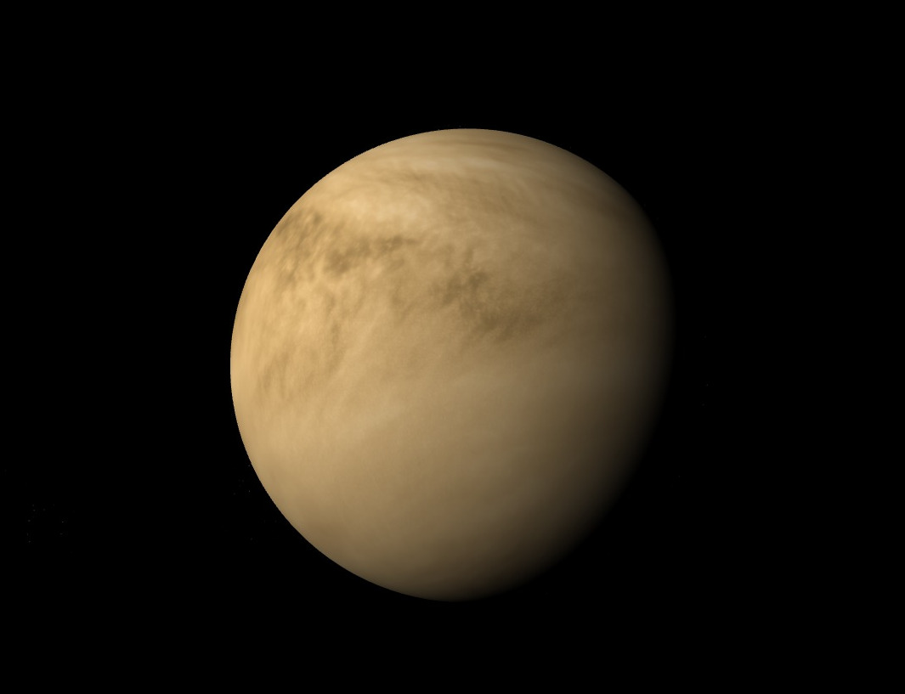

# _Astra_ language specification.
Version 1.0

This is the standard for _Astra_, a language designed for astronomy and astronautics simulation, modeling and visualization.

## _Philosophy:_ 
Astra defines its commands and sentences in such a way that they are most similar to natural language spoken in plain English. Also, for some expressions, Astra is inspired in mathematics notation and physics ways to express concepts and facts. In practical therms, the objective of Astra is to simplify at maximum the code needed to produce an astronomic simulation, model, image or diagram.

## _Usage:_ 
This is a [_**language specification**_](https://en.wikipedia.org/wiki/Programming_language_specification), which means that here is not chosen the programming language that should be used to create the interpreter, debugger or/and compiler. Any implementation that follows the rules presented in this document is an _Astra Language Implementation_.

## 1. Script Layout and environment blocks.
Any Astra script file is divided into blocks; there are three environment block types: 
+ `space`
+ `observer`
+ `output`

The general structure to follow is the next:
```
start <block_type> <attribute_1> <attribute_2> ...
   <my code...>  
End <block_type>
```
If attributes are not specified, default attributes will be taken.

The block type `space` defines the physical environment. 
```
start space euclidean static

End space
```
Block environment type `observer` defines coordinate reference frame, camera settings, and observer movements. For instance:

```
Start observer heliocentric

End observer
```

Block environment type `output` defines output product properties. For example, the next code is used to get a 3D Scene as output.
```
Start output scene

End output
```
If the definition of a environment fits in one line, the end marker is optional. For instance this code would be valid:

```
start space euclidean static
  <more definitions..>
End space
Start observer heliocentric
Start output scene
```

## 2. Objects
Astra has several _types_ of object variables that represent different entities from nature and human technology. Also, there are types to represent geometric auxiliar objects, like orbits and planes.

**Sintaxis:** when declaring an object, the type of the object comes before its name. For instance, to declare that variable `x` is a planet we state:

```
planet x
```
If we want `planet x` to exist in our defined space, we declare the object inside a space definition block:
```
Start space
  planet x
end space
```
Any object that has a oficial name, can be referred by its constant (see list of constants). So we can declare 

```
Start space
  Venus
end space
```
to create a euclidean space that hosts the planet Venus alone.

For example, the code
```
Start space
  Venus
end space

Start observer heliocentric
 in front of Venus
End observer

Start output image
```
should return a picture similar to the next:




Here is the list of native object types:

### Physical natural
+ `planet`
+ `atmosphere`
+ `moon`
+ `ring`
+ `asteroid`
+ `star`
+ `belt`
+ `shell`
+ `nebulae`
+ `black Hole`
+ `cluster`
+ `galaxy`
+ `flux`
+ `field`
+ `particle`

### Man-made
+ `satellite`
+ `spacecraft`
+ `launcher`
+ `lander`

### Auxiliar
+ `orbit`
+ `path`
+ `axis`
+ `point`
+ `angle`
+ `plane`
+ `surface`
+ `volume`
+ `label`

Objects can have _properties_ and _components_.
To make reference of a component you should mention the object, and then the type of the component.
For instance, `Earth atmosphere` is using the constant `Earth` and the object type `atmosphere`. 

In some cases components have proper names. For example the constant `Moon` is equivalent to `Earth moon`. (`Moon` is a component of the `Earth-Moon` system.)

## 3. Environments (Space)
 + `euclidean`

### Universe _actions_:
+ `set`
+ `orbit`
+ `move`
+ `gravitate`
+ `create`
+ `destroy`

## 4. Observer
The observer has actions and settings. Actions are instructions that make the camera do something.
Valid observer _actions_:
+ `goto`
+ `jump to`
+ `show`
+ `hide`
+ `around`
+ `zoom`
+ `set`

Observer settings are properties that are settled before the creation of the observer object.

Valid observer settings:
+ `frame`
  + `heliocentric`
  + `heliocentric baryonic`
  + `geocentric`
  + `user_defined`
+ `lens`
+ `position`
+ `orientation`
    + `target`
+ `vision_type`
    `visible`
    `infrared`
    `ultraviolet`
    `gamma-rays`
    `user_defined`
+ `controller`


## Secuencies
Ordered collection of observer actions.

Example:
```
Step 2
goto Earth
hide Earth atmosphere
show Earth rotational axis
show Earth orbit
zoom to Earth North pole
show North pole label
```

## Processes
Ordered collection of universe actions.
```
Step
move Jupiter to point_1
move Io in path_4
create asteroid on point_3
```


## Product settings
Product types:
+ `Scene`
+ `Image`
+ `Video`
+ `Diagram`

## Sets
Sets of objects are defined as in mathematical notation:

```
 <Set_name> := {<object_1>, <object_2>,... ,<object_n>}
```
```
 <Set_name> := {all <variable> such that <variable> is <object_type>}
```

## Systems
Systems are set of objects that interact physically and those interactions are consider to merge all set elements into a structure. 

The syntactic pattern is:
```
System[<SetOfObjects>]
```
Some systems are denoted by their own constant names. For instance `Earth-Moon system` is the system `System[Earth, Moon]`.

## Functions

Functions are defined outside of the block types. It's syntax can be defined by the implementation, using the same function syntax used for the language where Astra is being implemented.
The same stands for **logic operators** and **math operators**.


## Reserved constants.
Oficial planets names and other astronomical objects are used as fixed constants:
+ Sun
+ Mercury
+ Venus
+ Earth
+ Moon
+ Mars
+ Phobos
+ Deimos
+ Jupiter
+ Io
+ Europa
+ Ganymede
+ Callisto
+ Saturn
+ Titan
+ Uranus
+ Neptune
+ Pluto
+ Ceres
+ Vesta

In general, any astronomic object that has a unambiguous oficial proper name, should hav a constant in Astra.